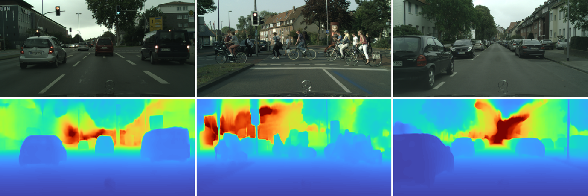

## [**Monocular Depth Estimation through Virtual-world Supervision and Real-world SfM Self-Supervision**](https://ieeexplore.ieee.org/document/9565825)

**Abstract:** Depth information is essential for on-board perception in autonomous driving and driver assistance. Monocular depth estimation (MDE) is very appealing since it allows for appearance and depth being on direct pixelwise correspondence without further calibration. Best MDE models are based on Convolutional Neural Networks (CNNs) trained in a supervised manner, i.e., assuming pixelwise ground truth (GT). Usually, this GT is acquired at training time through a calibrated multi-modal suite of sensors. However, also using only a monocular system at training time is cheaper and more scalable. This is possible by relying on structure-from-motion (SfM) principles to generate self-supervision. Nevertheless, problems of camouflaged objects, visibility changes, static-camera intervals, textureless areas, and scale ambiguity, diminish the usefulness of such self-supervision. In this paper, we perform monocular depth estimation by virtual-world supervision (MonoDEVS) and real-world SfM self-supervision. We compensate the SfM self-supervision limitations by leveraging virtual-world images with accurate semantic and depth supervision and addressing the virtual-to-real domain gap. Our [**MonoDEVSNet**](https://arxiv.org/pdf/2103.12209v2.pdf) outperforms previous MDE CNNs trained on monocular and even stereo sequences.


()


This is an official [**PyTorch**](https://pytorch.org/) implementation of Monocular Depth Estimation through Virtual-world Supervision and Real-world SfM Self-Supervision. 

IEEE Transactions on Intelligent Transportation Systems - 2021 [**(link)**](https://ieeexplore.ieee.org/document/9565825)

Arxiv - [**link**](https://arxiv.org/abs/2103.12209v2) - [**pdf**](https://arxiv.org/pdf/2103.12209v2.pdf)

[**Video Presentation**](https://www.youtube.com/watch?v=fD-VZkvaQdo) On Monocular Depth Estimation: (1) **MonoDEVS** ; (2) Multi-modal Co-training by **Antonio M. López** at **3rd 3D-DLAD @IV'2021**


*Akhil Gurram, Ahmet Faruk Tuna, Fengyi Shen, Onay Urfalioglu, Antonio M. López*.


## How To Use
**Clone** this github repository:
```bash
  git clone https://github.com/HMRC-AEL/MonoDEVSNet.git
  cd MonoDEVSNet
```

**Create Environment** using pip3

```bash
  pip3 install -r requirements
```


**Create conda** environment based on Conda distribution. All dependencies are in [`MonoDEVSNet_env.yaml`](configs/MonoDEVSNet_env.yaml) file in configs folder.

```bash
  conda env create -f configs/MonoDEVSNet_env.yaml
```


**Environment activation/deactivation**
```bash
  conda activate MonoDEVSNet
  conda deactivate
```

We run our experiments using PyTorch >= 1.5.0, Torchvision>=0.8.2, CUDA>=10.2, Python>=3.7.x with batch_size=12 

**Prepare monodepth2 framework**

Clone monodepth2 repository with minor corrections

```bash
    cd utils
    chmod +x prepare_monodepth2_framework.sh
    ./prepare_monodepth2_framework.sh
    cd ..
```

**Prepare KITTI / Virtual KITTI datasets**

You can download the entire raw [**KITTI**](http://www.cvlibs.net/datasets/kitti/raw_data.php) dataset by running:
```bash
    wget -i monodepth2/splits/kitti_archives_to_download.txt -P <downloaded_K_folder_path/>
    cd <downloaded_K_folder_path>
    unzip "*.zip"
```

You can download the entire Virtual KITTI [*1.3*](https://europe.naverlabs.com/research/computer-vision/proxy-virtual-worlds-vkitti-1/) / [*2.0*](https://europe.naverlabs.com/research/computer-vision/proxy-virtual-worlds-vkitti-2/) into a folder
```bash
    cd <downloaded_vk_folder_path>
    tar -xvf vkitti_2.0.3_rgb.tar
    tar -xvf vkitti_2.0.3_depth.tar
    tar -xvf vkitti_2.0.3_classSegmentation.tar
```

## New model - MonoDELSNet
Monocular Depth Estimation through LiDAR Supervision and Real-world SfM Self-Supervision. \
In this variant, we replace the supervision coming from the virtual data to supervision coming from LiDAR
data, this is why we use the term MonoDELSNet instead of MonoDEVSNet. 


## Training

By default models and tensorboard event files are saved to ~/tmp/<model_name>. This can be changed with the --log_dir flag.

#### Set the configuration file. 

Set pretrained model path in the config file ([path](configs/hrnet_w48_vk2.yaml)) (if necessary download models from [link](https://github.com/HRNet/HRNet-Image-Classification))

```bash
    # MonoDEVSNet
    cd <MonoDEVSNet_base_path>
    python3 monodevsnet_trainer.py --png --use_dc --use_le --use_ms --version <an_extension_to_model_name> \
    --models_fcn_name encoder <HRNet/ResNet/DenseNet> --num_layers <model_extension_num> \
    --real_dataset kitti --syn_dataset <vk_1.0/vk_2.0> --real_data_path <path_to_real_dataset_folder> --syn_data_path <path_to_synthetic_dataset_folder>
```

```bash
    # For the best MonoDELSNet model - HRNet-w48 - HD RGB input image (1248, 384) - LiDAR Supervision
    cd <MonoDEVSNet_base_path>
    python3 monodevsnet_trainer.py --png --use_le --version <an_extension_to_model_name> --height 384 --width 1248 \
    --models_fcn_name encoder <HRNet/ResNet/DenseNet> --num_layers <model_extension_num> \
    --real_dataset kitti --syn_dataset kitti_depth --real_data_path <path_to_real_dataset_folder> --syn_data_path <path_to_real_dataset_folder>
```

## Evaluation

To evaluate MonoDEVSNet/MonoDELSNet models, provide the model/weights folder path and details in the command line arguments.

To run evaluation script on [***KITTI***](http://www.cvlibs.net/datasets/kitti/raw_data.php) [*Eigen*](splits/eigen/test_files.txt) split with **original depth maps** extracted from raw LiDAR sensor. 
```bash
    python3 evaluation.py --png --dataset kitti --batch_size 1 \ 
    --models_fcn_name encoder <HRNet/ResNet/DenseNet> --num_layers <model_extension_num> \ 
    --real_data_path <KITTI_RAW_Dataset_base_folder_path> --load_weights_folder <path_to_MonoDEVSNet_models> \    
    [--version <add_extension_to_save_the_file(rgbs/predicted_depth_maps)>](optional)
```

To run evaluation script on [***KITTI***](http://www.cvlibs.net/datasets/kitti/raw_data.php) [*Eigen*](splits/eigen/test_files.txt) split with **improved (annotated) depth maps.**
```bash
    python3 evaluation.py --png --dataset kitti_depth --batch_size 1 --do_kb_crop \ 
    --models_fcn_name encoder <HRNet/ResNet/DenseNet> --num_layers <model_extension_num> \ 
    --real_data_path <KITTI_RAW_Dataset_base_folder_path> --load_weights_folder <path_to_MonoDELSNet_models> \    
    [--version <add_extension_to_save_the_file(rgbs/predicted_depth_maps)>](optional)
```


To run evaluation script on ***any*** images 
```bash
    python3 evaluation.py --dataset any --models_fcn_name encoder <HRNet/ResNet/DenseNet> --num_layers <model_extension_num> \ 
    --image_folder_path <path_to_image_dir> \
    --load_weights_folder <path_to_MonoDEVSNet_models> \    
```

## Models
Download available MonoDEVSNet models from the [**link**](https://drive.google.com/drive/folders/1_Zbk6AjOcJ34ERlB8mpu5xT84ptbd1Iz?usp=sharing) and place them under MonoDEVSNet/models folder. Rename the each `MODEL` folder name, same as their config-filename.

Now MonoDEVSNet framework can be trained with different network architecture. (HRNet, ResNet, DenseNet)

Links to pretrained weights: [**md_file**](models/pretrained_models.md)

## Precomputed depth estimation results

To visualize the MonoDEVSNet results, run 

```bash
  python3 utils/load_eval_output.py --file_path <PATH_TO_SAVED/DOWNLOADED_FILE>
``` 

| Model | Encoder | Virtual dataset | Link |
| :--- | :---: | :---: | :---: |
| MonoDEVSNet | HRNet W48 | vK 1.0 | [**Download**](https://drive.google.com/file/d/1MpCXKVih-LKFVtQ0Nm4CR53sJpk0T5Ah/view?usp=sharing)
| MonoDEVSNet | HRNet W48 | vK 2.0 | [**Download**](https://drive.google.com/file/d/1DLLyaHVdsmifyFGatzpU4vIvu-CcfR2I/view?usp=sharing)

## Generalization: Qualitative results on CITYSCAPES.




## Related projects

[**monodepth2**](https://github.com/nianticlabs/monodepth2): Digging into Self-Supervised Monocular Depth Prediction

[**mono-uncertainty**](https://github.com/mattpoggi/mono-uncertainty): On the uncertainty of
self-supervised monocular depth estimation

[**HRNet-Image-Classification**](https://github.com/HRNet/HRNet-Image-Classification): High-resolution networks (HRNets) for Image classification

[**DenseNet**](https://github.com/pytorch/vision/blob/master/torchvision/models/densenet.py): Densely Connected Convolutional Networks

## **************** Update ****************

Lately verified our training and inference scripts with newer python packages: 
torch==1.9.0, torchvision==0.10.0, CUDA=11.3, python==3.8.10, numpy==1.21.0 with batch_size=12

## License
The source code is released under the [MIT license](LICENSE.md).

## Cite
If you want to cite the framework feel free to use this preprint citation while we await publication:

**Monocular Depth Estimation through Virtual-world Supervision and Real-world SfM Self-Supervision.**

*Akhil Gurram, Ahmet Faruk Tuna, Fengyi Shen, Onay Urfalioglu, Antonio M. López*

```bibtex
@ARTICLE{9565825,
  author={Gurram, Akhil and Tuna, Ahmet Faruk and Shen, Fengyi and Urfalioglu, Onay and López, Antonio M.},
  journal={IEEE Transactions on Intelligent Transportation Systems}, 
  title={Monocular Depth Estimation Through Virtual-World Supervision and Real-World SfM Self-Supervision}, 
  year={2021},
  volume={},
  number={},
  pages={1-14},
  doi={10.1109/TITS.2021.3117059}}
```

Contact: akhil.gurram@e-campus.uab.cat or akhilgurram.ai@gmail.com
